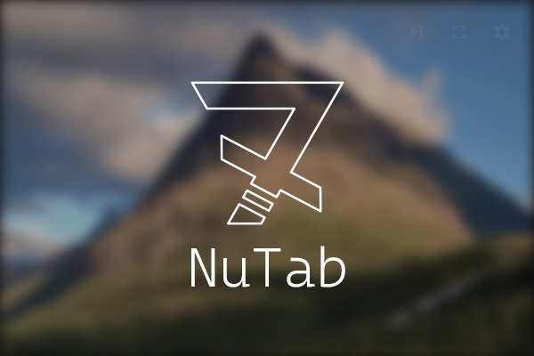

NuTab
=====

NuTab is a new tab/start page extension for a beautiful background slideshow with a clock.

NuTab gets its source of images from [Unsplash][1]. With just a complementary clock, this extension's main goal is to let your monitor provide more life for your desk. 

Development
-----------
NuTab is a React web application written in TypeScript. To develop on your own, just clone/fork the repo, type <code>yarn install</code> and code away!
You will need to provide your own API key from Unsplash in your own <code>.env</code>-file. You can easily obtain one by creating a deverloper account. Use <code>.env.example</code> as a template.

License
-------
Apache 2.0 where applicable. See licenses.json and LICENSE files for details.

Contributing
------------
Pull requests are welcome!

Author
------
Freddie Lust-Hed - @musenkishi

[1]: https://unsplash.com
